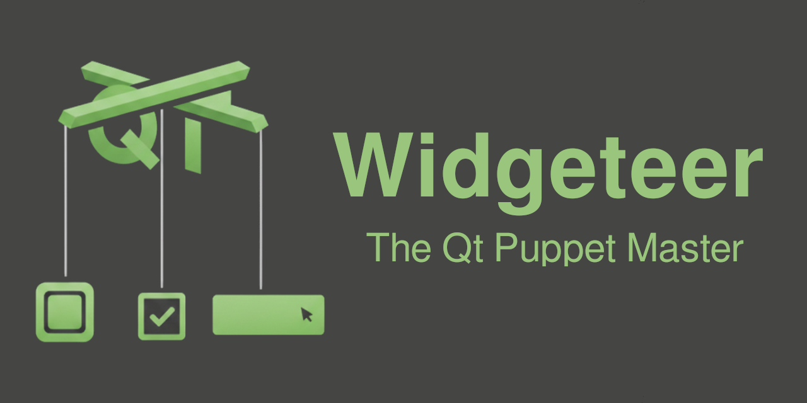
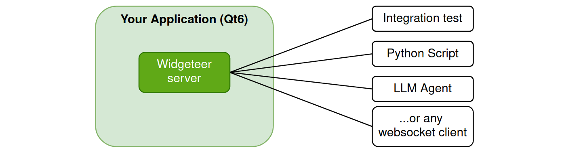
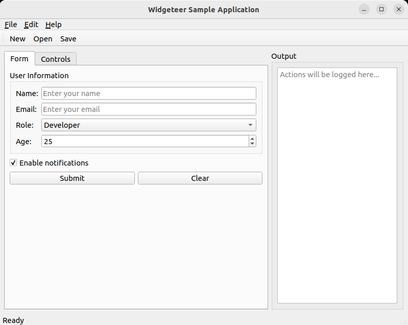

# Qt Widgeteer

[](https://github.com/AurynRobotics/qt-widgeteer/actions/workflows/ci.yml)
[](https://codecov.io/gh/AurynRobotics/qt-widgeteer)

A Qt6 UI testing and automation framework designed for LLM agent control, GUI automation and integration testing.

You just need **2 lines of code** to make any Qt app controllable by:
 - AI agents
 - external integration tests
 - scripts, or
 - remote clients.




```
User: "Fill out the registration form with test data and submit it"

LLM:  I'll discover the form fields first.
      > get_form_fields()
      Found: Name (text), Email (text), Age (spinbox)

      Now I'll fill out the form with test data.
      > input_text("#nameEdit", "Alice Smith")     ✓
      > input_text("#emailEdit", "alice@example.com")  ✓
      > set_value("#ageSpinBox", 28)               ✓
      > click("#submitButton")                     ✓

      Let me verify the submission worked.
      > get_property("#outputText", "plainText")
      → "Form submitted: Alice Smith <alice@example.com>"

      Done! The form was submitted successfully.
```

## Key Features

- **Discoverable UI**: Agents explore the widget hierarchy without prior knowledge
- **Minimal Integration**: 2 lines of code to instrument any Qt6 application
- **Zero Dependencies**: Uses only Qt6 modules (no external libraries)
- **Language Agnostic**: JSON over WebSocket works from Python, JavaScript, or raw CLI
- **Record & Replay**: Capture user interactions as replayable JSON test scripts
- **Remote Control**: Automate Qt applications from any language with WebSocket support

## What Can You Do?

Non comprehensive list of things that you can do with Widgeteer:

1. **Discover the UI** — Get the full widget tree with types, properties, and hierarchy
2. **Click anything** — Buttons, checkboxes, menu items, table cells, tree nodes
3. **Type text** — Fill line edits, text areas, spin boxes, combo box searches
4. **Read properties** — Check text, values, enabled state, visibility, geometry
5. **Wait for conditions** — Element exists, becomes visible, property changes, signal emits
6. **Take screenshots** — Capture widgets or full windows as base64 PNG
7. **Invoke methods** — Call slots and Q_INVOKABLE methods directly
8. **Subscribe to events** — Get notified when buttons are clicked, values change, windows open
9. **Record sessions** — Capture interactions as replayable JSON test scripts
10. **Assert state** — Verify property values with operators (==, !=, contains, >=, etc.)

## Quick Start

Add two lines to your Qt application:

```cpp
#include <widgeteer/Server.h>

int main(int argc, char* argv[]) {
    QApplication app(argc, argv);

    widgeteer::Server server;
    server.start(9000);  // WebSocket server on port 9000

    MainWindow window;
    window.show();
    return app.exec();
}
```

Then connect and interact:

```python
from widgeteer_client import SyncWidgeteerClient

with SyncWidgeteerClient(port=9000) as client:
    tree = client.tree()                              # Discover all widgets
    client.click("@name:submitButton")                # Click by object name
    client.type_text("@name:emailField", "test@example.com")
    client.wait("@name:statusLabel", condition="visible")  # Wait for UI update
    status = client.get_property("@name:statusLabel", "text").value
```

Or send raw JSON commands via any WebSocket client:

```bash
wscat -c ws://localhost:9000
> {"type":"command","id":"1","command":"get_tree","params":{}}
> {"type":"command","id":"2","command":"click","params":{"target":"@name:submitButton"}}
> {"type":"command","id":"3","command":"type","params":{"target":"@name:emailField","text":"test@example.com"}}
> {"type":"command","id":"4","command":"wait","params":{"target":"@name:statusLabel","condition":"visible"}}
> {"type":"command","id":"5","command":"get_property","params":{"target":"@name:statusLabel","property":"text"}}
```

## Sample Application

The repository includes a sample Qt application with various widgets to experiment with Widgeteer. It demonstrates forms, controls, dialogs, and more — perfect for learning the API or testing your automation scripts.

<table>
<tr>
<td></td>
<td></td>
</tr>
</table>

```bash
# Build and run the sample application
cmake -B build && cmake --build build --parallel
./build/sample/widgeteer_sample 9000
```

Then connect via WebSocket on port 9000 and start exploring.

## Building

```bash
git clone https://github.com/user/widgeteer.git
cd widgeteer && mkdir build && cd build
cmake .. -DCMAKE_BUILD_TYPE=Release
cmake --build . --parallel
```

Requires CMake 3.18+, Qt6, and a C++17 compiler.

## Documentation

- [User Manual](docs/user-manual.md) — Setup, selectors, and usage examples
- [Protocol Reference](docs/protocol.md) — Complete WebSocket API specification
- [LLM Integration Guide](docs/llm_user_manual.md) — Optimized reference for AI agents (add to system prompt)
- [Architecture](docs/architecture.md) — Internals guide for modifying the codebase

## Disclaimer

This application was 100% vibe-coded by Claude Code and it was specifically optimized for LLM.

Hopefully the API, protocol and documentation are also human-friendly,
but my primary focus is to create a harness that LLM can use to debug and create automated tests
for Qt C++ applications as autonomously as possible.

## License

MIT License
